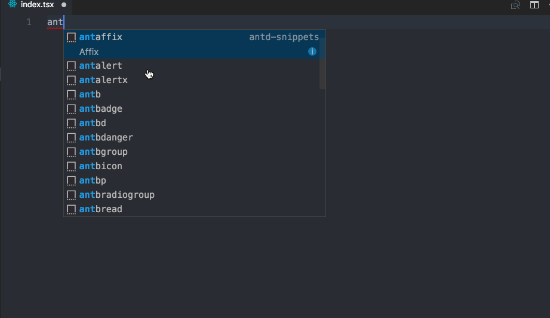

[](https://ant.design/)

# antd-snippets

> Ant-Design Snippets for VS Code

## Install

[Install the extension here](https://marketplace.visualstudio.com/items?itemName=bang.antd-snippets)

Or by opening the Command Palette (Ctrl+Shift+P), and running

```sh
ext install antd-snippets
```

[](###)


### Available Snippets

Trigger | Description
--- | ---
antbutton | Button
antbutton-w-icon | Button with Icon
antbutton-radio-group | Radio Group Button
antbutton-group | Basic Button Group
anticon | Icon
antrow | The Basic Grid Row
antlayout | The Basic Layout
antaffix | Affix
antbread | Breadcrumb
antdropdown | The Basic Dropdown
antmenu | Menu
antsteps | Steps
anttabs | Tabs
antlist | List
antcascader | Cascader
anttag | Tag
antdatepicker | DatePicker
antdatepicker-monthpicker | MonthPicker
antdatepicker-rangepicker | RangePicker
antdatepicker-weekpicker | WeekPicker
anttimepicker | TimePicker
antavatar | Avatar
antautocomplete | AutoComplete
antpagination | Pagination
antcheckbox | The Basic Checkbox
antcheckbox-group | Generate a group of checkboxes from an array
antform | Create a vertical Form
antform-horizontal | Horizontal Form
antform-wrapped | Create a Form to be wrapped by Form.create()
antform-inline | Create an inline Form
antinput | Basic Input
antinput-addon | Input With addon
antinput-number | Input Number
antinput-formatted | Input Formatted
antinput-select | Create an Input Group with Select
antinput-group | Input Group
antinput-group-compact | Create an Input Gourp with compact mode
antslider | Slider
antswitch | Switch
antcard | Carousel
antrate | Rate
antprogress | Progress
antskeleton | Skeleton
antspin | Spin
antspin-container | Spin in Container
antradio | Radio
antradiogroup | Radio Group
antradiogroup-button | Radio Button Group
antselect | Select
antbadge | Badge
antcard | Card with extra
antcollapse | Collapse
antpopover | Popover
anttooltip | Tooltip
anttable | Basic JSX Style Table
anttimeline | Timeline
antalert | Alert
antmodal | Modal
antmodal-info | Information Modal
antmessage | Message
antnotification | Notification
antpopconfirm | Popconfirm

